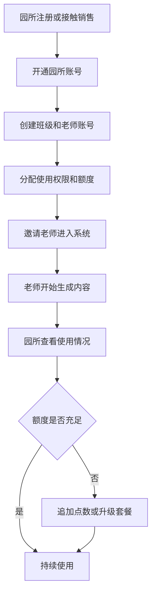
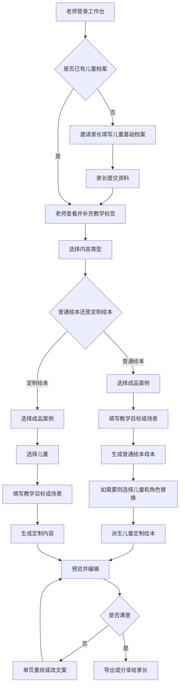
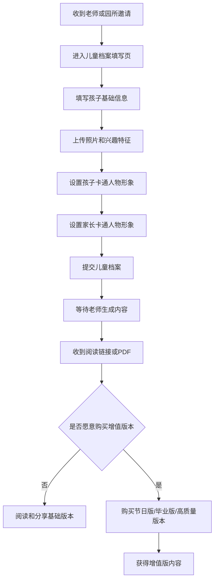
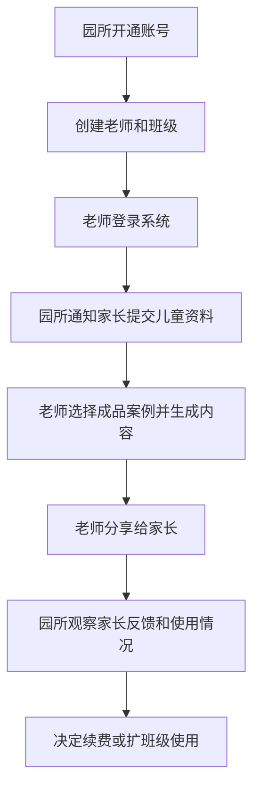
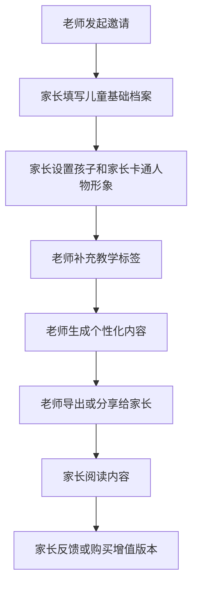
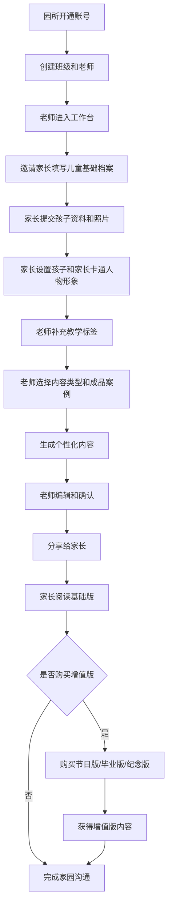

# 角色操作流程图

## 目标

定义儿童定制读本产品中不同角色的主要操作流程，帮助统一：
- 产品流程理解
- 页面跳转设计
- 后续原型绘制
- 权限和职责划分

当前重点角色包括：
- 园所
- 老师
- 家长

## 角色关系总览

这三个角色在产品中的分工是：

- 园所负责开通、组织和采购
- 老师负责使用、生成、编辑和交付
- 家长负责提交儿童基础档案、接收内容和增值购买

一句话概括：

`园所开通和推动，老师生产和交付，家长提供资料并接收内容。`

## 1. 园所操作流程

### 流程说明

园所是组织者和主要付款方，主要负责：
- 开通账号
- 配置班级和老师
- 管理额度
- 推动老师使用
- 观察使用情况

### Mermaid 流程图

### 园所关键动作

1. 注册或由销售开通园所账号
2. 创建班级和老师账号
3. 分配额度或套餐
4. 邀请老师使用
5. 查看内容使用和分享情况
6. 决定是否追加购买

## 2. 老师操作流程

### 流程说明

老师是核心使用者，主要负责：
- 查看儿童档案
- 发起内容生成
- 编辑内容
- 导出或分享给家长

### Mermaid 流程图

### 老师关键动作

1. 登录工作台
2. 检查儿童档案是否完整
3. 邀请家长补齐基础信息
4. 补充教学观察标签
5. 选择内容类型和成品案例
6. 可先生成普通绘本母本，再派生定制版本
7. 修改文案或单页图片
8. 导出 PDF 或分享链接

## 3. 家长操作流程

### 流程说明

家长在产品中的主要职责不是创作，而是：
- 填写儿童基础资料
- 上传照片
- 设置自己和孩子的卡通人物形象
- 接收老师生成的内容
- 在合适场景下购买增值版本

### Mermaid 流程图

### 家长关键动作

1. 接收邀请
2. 填写儿童基础资料
3. 上传照片和兴趣信息
4. 设置孩子卡通人物形象
5. 设置家长卡通人物形象
6. 提交档案
7. 接收老师分享的内容
8. 选择是否购买增值版本

## 4. 园所-老师协同流程

### 流程说明

这个流程强调组织内部如何从开通走到实际使用。

### Mermaid 流程图

## 5. 老师-家长协同流程

### 流程说明

这是最核心的家园沟通流程。

### Mermaid 流程图

## 6. 全链路流程图

### 流程说明

这张图用于看清从园所开通到家长接收内容的完整链路。

### Mermaid 流程图

## 7. 页面映射建议

为方便后续原型设计，角色流程和页面建议对应如下：

### 园所相关页面

- 园所开通页
- 班级和老师管理页
- 套餐和额度页
- 使用情况总览页

### 老师相关页面

- 工作台
- 内容中心
- 儿童档案页
- 成品案例中心
- 生成配置页
- 内容编辑页
- 导出与分享页

### 家长相关页面

- 家长邀请页
- 儿童基础档案填写页
- 儿童卡通人物形象设置页
- 家长卡通人物形象设置页
- 内容阅读页
- 增值购买页

## 8. 最终结论

这个产品的流程不是单角色闭环，而是三角色协作闭环：

- 园所负责组织与预算
- 老师负责内容生产与交付
- 家长负责基础信息输入与内容接收

因此后续在页面和权限设计上，应始终围绕这三类角色的分工展开，而不是只按“老师工具”思路设计。
